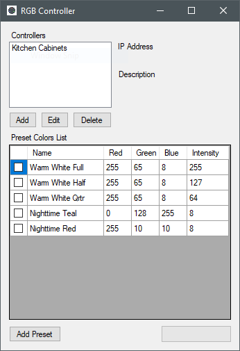
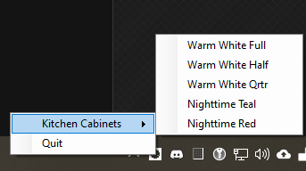

# ESP-RGB-Controller
Tiny ESP8266-based RGB LED controller


## Board Hardware
*Located in the root directory*

Included is the kicad project for the PCB. It's very simple and requires minimal parts. An included BOM.txt gives part numbers used for my assemblies. However, feel free to substitute parts as you see fit.

## Board Firmware
*Located in the SW-Arduino Directory*

The MCU is an AtMega328P in 32-TQFP package. **You will need an ISP tool to flash the firmware, such as a [USBTinyISP](https://learn.adafruit.com/usbtinyisp) or an [Arduino flashed as an ISP](https://www.arduino.cc/en/Tutorial/BuiltInExamples/ArduinoISP).**

The firmware was designed to run on the [Minicore Arduino platform](https://github.com/MCUdude/MiniCore). You will need to add this to your boards manager and install it in your Arduino IDE. The following settings are used to compile and flash the firmware:

* Board: AtMega328
* Clock: Internal 8MHz
* BOD: 2.7V
* EEPROM: EEPROM retained
* Compiler LTO: LTO Disabled
* Variant: 328P/PA
* Bootloader: No Bootloader

You will also need the WifiEspAt library for Arduino, and will need to edit the Wifi login credentials to match your wifi network. Otherwise, it should be plug and play with up-to-date ESP-01 modules.

**Note: You will need to update your ESP-01 modules to AT version 2.1 or greater. See [the following page on firmware versions from the WifiESPAt library](https://github.com/jandrassy/WiFiEspAT#at-firmware-versions)**

A minor overview of the features of this firmware:
* Recalls last state on power-up, useful if power is interrupted
* Reports the current setting in a small webpage when the GET request is recieved, useful for status checking

## Control the lights!
### GET Requests
The simplest method of control is through your browser, with a simple HTTP GET request like so:
```
http://<ip.address>?rgb=255,255,255
```
This will set all three color channels to full brightness.
### Controller App
*Locategd in SW-TrayTool*



You can build the C# Windows Forms app for a slightly more robust control system. The tool includes provisions for multiple controllers and presets, as well as a tray icon for controlling lights in a nice clean way.


