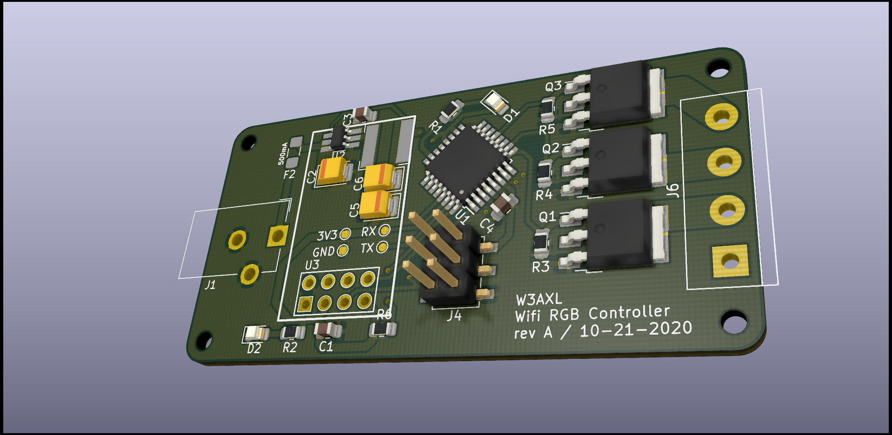

# ESP-RGB-Controller
Tiny ESP8266-based RGB LED controller



## Board Firmware
*Located in the SW-Arduino Directory*

You will need the WifiEspAt library for Arduino, and will need to edit the Wifi login credentials to match your wifi network. Otherwise, it should be plug and play with up-to-date ESP-01 modules. 

**Note: You will need to update your ESP-01 modules to AT version 2.1 or greater. See [the following page on firmware versions from the WifiESPAt library](https://github.com/jandrassy/WiFiEspAT#at-firmware-versions)**

## Control the lights!
### GET Requests
The simplest method of control is through your browser, with a simple HTTP GET request like so:
```
http://<ip.address>?rgb=255,255,255
```
This will set all three color channels to full brightness.
### Controller App
*Locategd in SW-TrayTool*


You can build the C# Windows Forms app for a slightly more robust control system. The tool includes provisions for multiple controllers and presets, as well as a tray icon for controlling lights in a nice clean way.


